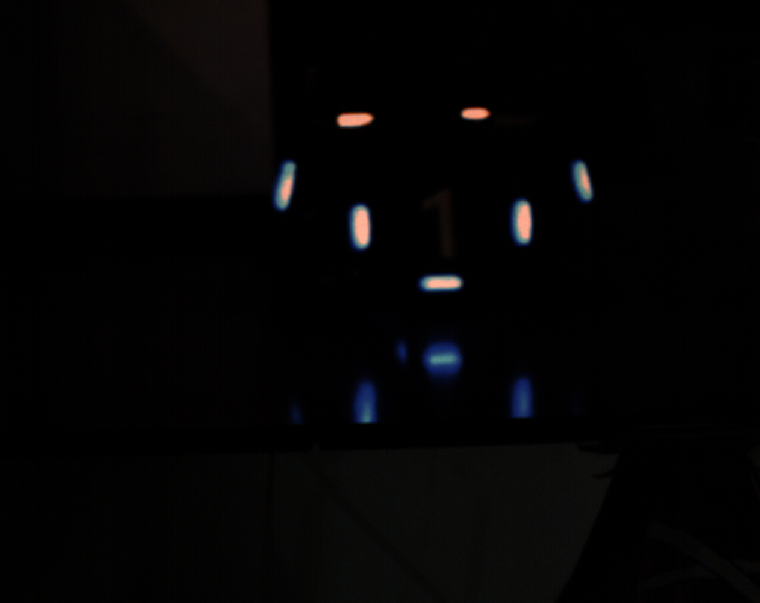
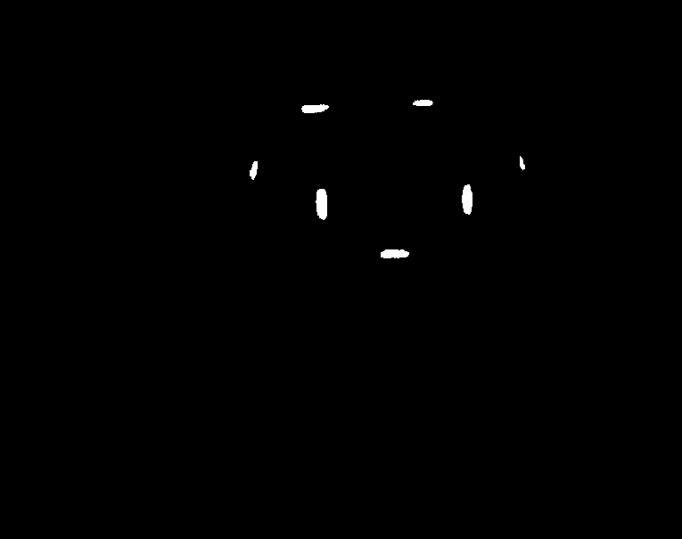
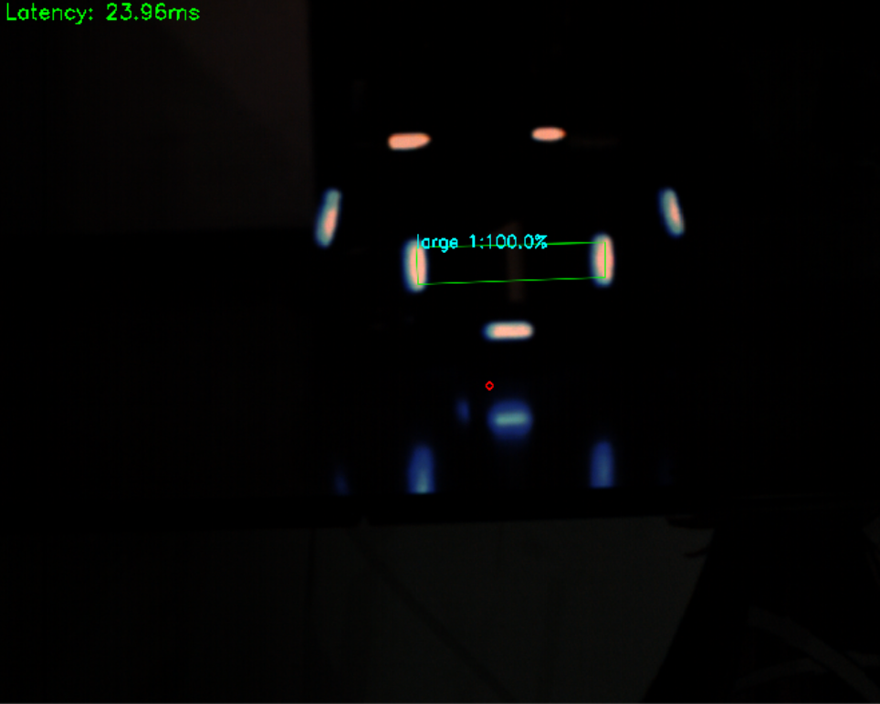
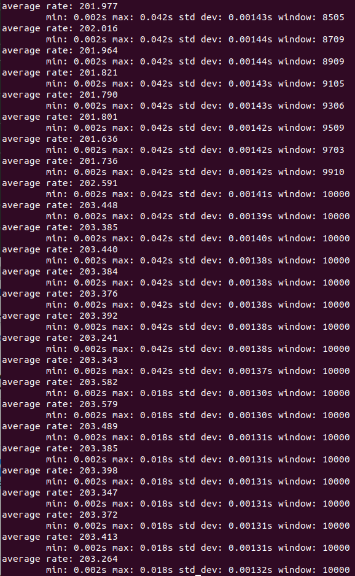
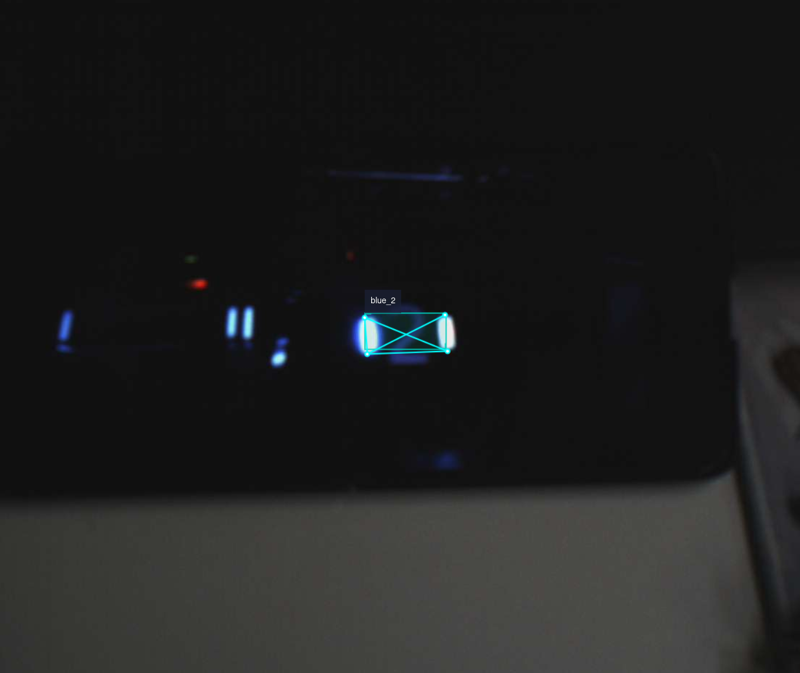
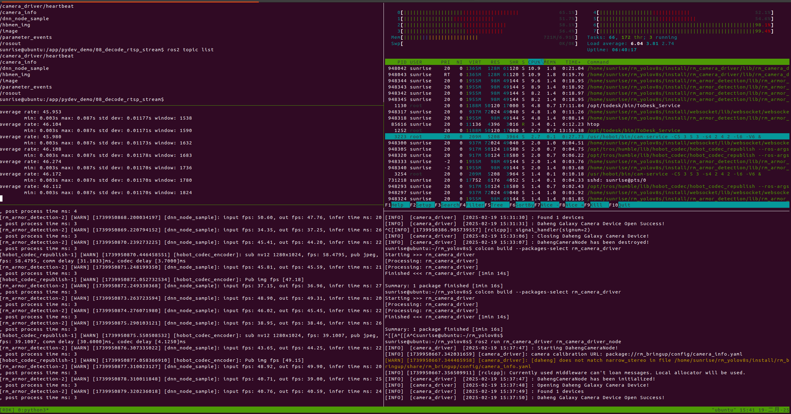

# RM Armor Tracker

This project aims to propose an **easy-to-use** set of detector and tracker.  
The feature code contains a lot of comments, and the **loosely** coupled framework allows for unit testing.  
The overall deployment scheme is gradual and can be used as a **beginner**'s practice project.  
____

English | [简体中文](./Readme_zh.md)  

## 1. Introduce

- **Recommended environment**

Based on the chenjun open-source **rm_vision** framework.  
The hardware of this project depends on **RDK_X5** and **Daheng industrial camera**.  
The software depends on **Ubuntu2204** and **ROS2humble**.  

- **Changelog**

***2025-1-8：Upload Basic functions***  
<pre>
.  
└── src  
    └── rm_armor_tracker  
        ├── rm_utils*  
        └── rm_camera_driver*  
</pre>
**rm_utils**: Basic math tools  
**rm_camera_driver**: Pubulish image_raw topic  

***2025-2-6：Add Conventional Detector***  
<pre>
.  
└── src  
    └── rm_armor_tracker  
        ├── rm_utils  
        ├── rm_camera_driver  
        ├── rm_interfaces*  
        └── armor_detector*  
</pre>
**rm_interfaces**: Define msgs and service  
**armor_detector**:Light strip identification  

***2025-2-20：Add Yolov8 Detector***
<pre>
.
└── src
    └── rm_armor_tracker
        ├── rm_utils
        ├── rm_camera_driver
        ├── rm_interfaces
        ├── armor_detector
        ├── rm_camera_driver_nv12*
        └── rm_armor_detection*
  </pre>
**rm_camera_driver_nv12**: Pubulish nv12_format image topic  
**rm_armor_detection**:Yolov8n inference  

____

## 2. Installation Instructions

### 2.1 Get source code  

- Create your workspace

  ```shell
  cd 
  ```  

  ```shell
  mkdir -p rm_ws/src | cd rm_ws
  ```  

- Initialize the workspace  

  ```shell
  colcon build
  ```  

  ```shell
  cd src
  ```  

- Fetch source code  

  ```shell
  git clone https://github.com/tianbot/rm_armor_tracker/tree/dev
  ```

____

### 2.2 Dependencies

Update the software package index  

  ```shell
  sudo apt-get update
  ```  

Dependencies Lists

- [camera SDK](#221-daheng-camera-sdk) :Hardware driver  
- [ros2 components](#222-ros2-common-component) :Provide commonly used functions  
- [math tools](#223-math-tools) :Conventional detector depend on  
- [tros components](#224-rdk_x5-tros-component) :Yolov8 algorithm depend on  

#### 2.2.1 DaHeng Camera SDK

Select the package according to your system version.

- **Aarch64--RDK_X5**

  ```shell
  wget https://gb.daheng-imaging.com/CN/Software/Cameras/Linux/Galaxy_Linux-armhf_Gige-U3_32bits-64bits_1.5.2303.9202.zip
  ```

- **X86_64--Linux**

  ```shell
  wget https://gb.daheng-imaging.com/CN/Software/Cameras/Linux/Galaxy_Linux-x86_Gige-U3_32bits-64bits_1.5.2303.9221.zip
  ```

- **X86_64--Win**

  ```shell
  wget https://gb.daheng-imaging.com/CN/Software/Cameras/Windows/Galaxy_Windows_CN_32bits-64bits_2.4.2501.9211.zip
  ```

Unzip the compressed package

  ```shell
  unzip Galaxy_Linux-armhf_Gige-U3_32bits-64bits_1.5.2303.9202
  ```

Run the automatic download script

  ```shell
  sudo bash ./Galaxy_camera.run
  ```

#### 2.2.2 ROS2 common component

- **camera_info_manager**  

  >It provides a C++ class used by many camera drivers to manage the camera calibration data required by the ROS image pipeline.  

  ```shell
  sudo apt-get install ros-humble-camera_info_manager
  ```  

- **image_transport**  

  >image_transport should always be used to subscribe to and publish images. It provides transparent.  

  ```shell
  sudo apt-get install ros-humble-image_transport
  ```

- **fmt**

  >an open-source formatting library providing a fast and safe alternative to C stdio and C++ iostreams.

  ```shell
  sudo apt-get install libfmt-dev
  ```

- **spdlog**

  >Fast C++ logging library

  ```shell
  sudo apt install  libspdlog-dev
  ```

- **absl**

  >Abseil is an open-source collection of C++ library code designed to augment the C++ standard library.  

  ```shell
   git clone https://github.com/abseil/abseil-cpp.git
  ```

  ```shell
  cd abseil-cpp
  ```
  
  ```shell
   mkdir build && cd build
  ```

  ```shell
  cmake ..
  ```

  ```shell
  make -j
  ```  

  ```shell
  sudo make install  
  ```

- **Qt**

  >Qt is a cross-platform application development framework for desktop, embedded and mobile.

  ```shell
  sudo apt install qtdeclarative5-dev qt5-qmake libqglviewer-dev-qt5
  ```

  If you want to try the AI ​​solution directly, jump to [2.2.4 RDK_X5 tros component(To Do)](#224-rdk_x5-tros-component)

#### 2.2.3 Math tools

- **eigen**

  >Eigen is a C++ template library for linear algebra: matrices, vectors, numerical solvers, and related algorithms.

  ```shell
  sudo apt install libeigen3-dev
  ```

- **suitesparse**

  > SuiteSparse is a set of sparse-matrix-related packages

  ```shell
  sudo apt install   libsuitesparse-dev
  ```

- **Ceres**  : <https://github.com/ceres-solver/ceres-solver>

  >Ceres Solver 1 is an open source C++ library for modeling and solving large, complicated optimization problems.  

  ```shell
  git clone --recurse-submodules https://github.com/ceres-solver/ceres-solver.git
  ```  

  ```shell
  cd ceres-solver-2.2.0
  ```  

  ```shell
  sudo gedit ./CMakeLists.txt
  ```

  find_package(Eigen3 3.3 REQUIRED)  >> find_package(Eigen3  REQUIRED)  
  
  ```shell
  mkdir build && cd build
  ```  

  ```shell
  cmake ..
  ```

  ```shell
  make -j
  ```  

  ```shell
  sudo make install  
  ```  

- **Sophus**  : <https://github.com/strasdat/Sophus>

  >Sophus is a C++ implementation of Lie groups commonly used for 2d and 3d geometric problems

  ```shell
  git clone https://github.com/strasdat/Sophus
  ```  

  ```shell
  cd Sophus-main
  ```  

  ```shell
  sudo gedit ./CMakeLists.txt
  ```

  cmake_minimum_required(VERSION 3.24)  >> cmake_minimum_required(VERSION 3.16)

  ```shell
  mkdir build && cd build
  ```  

  ```shell
  cmake ..
  ```

  ```shell
  make -j
  ```  

  ```shell
  sudo make install  
  ```

- **G2O** : <https://github.com/RainerKuemmerle/g2o>

  >g2o is an open-source C++ framework for optimizing graph-based nonlinear error functions.

  ```shell
  git clone https://github.com/RainerKuemmerle/g2o
  ```  

  ```shell
  cd g2o
  ```  

  ```shell
  mkdir build && cd build
  ```  

  ```shell
  cmake ..
  ```

  ```shell
  make -j
  ```  

  ```shell
  sudo make install  
  ```  

#### 2.2.4 RDK_X5 tros component

- hobot_msgs : <https://github.com/D-Robotics/hobot_msgs>  

    ```shell
    sudo apt install tros-humble-hbm-img-msgs tros-humble-ai-msgs    
    ```  

    >Custom message

- dnn-node : <https://github.com/D-Robotics/hobot_dnn>

    ```shell
    sudo apt install tros-humble-dnn-node   
    ```  

  > Neural network

- hobot-cv : <https://github.com/D-Robotics/hobot_cv>

  ```shell
  sudo apt install tros-humble-hobot-cv   
  ```  

  >BPU computing optimization

- hobot_codec : <https://github.com/D-Robotics/hobot_codec>

  ```shell
  sudo apt install sudo apt install tros-humble-hobot-codec   
  ```  

  >Display image messages published by a ROS2 Node

- websocket : <https://github.com/D-Robotics/hobot_websocket>

  ```shell
  sudo apt install sudo apt install tros-humble-websocket   
  ```

  >Web Visualization  
  
____

## 3. Compilation  

### 3.1 Conventional Detector  

- Compile the feature package  

    ```shell
    colcon build  --packages-select rm_utils
    ```  

    ```shell
    colcon build  --packages-select rm_interfaces
    ```  

    ```shell
    colcon build  --packages-select rm_camera_driver
    ```  

    ```shell
    colcon build  --packages-select armor_detector
    ```  

### 3.2 YoLo v8 Detector

- Compile the feature package  

    ```shell
    colcon build  --packages-select rm_camera_driver_nv12
    ```  

    ```shell
    colcon build  --packages-select rm_armor_detection
    ```  

### 3.3 Add environment variables  

  ```shell
  source install/setup.bash
  ```  

____

## 4. Launch Project

### 4.1 Conventional Detector  

- **Start Camera Node**  

  ```shell
  ros2 run rm_camera_driver rm_camera_node
  ```  

  *Topic*: /image_raw  

- **TF Static Publisher**

  ```shell
  ros2 run tf2_ros static_transform_publisher --frame-id odom --child-frame-id camera_optical_frame --x 0.5 --y 0.0 --z 0.0 --roll 0.0 --pitch 0.0 --yaw 0.0
  ```

- **Start Detector Node**  

  ```shell
  ros2 run armor_detector armor_detector_node
  ```  

  *Topic*: /armor_detector/result_img  

- **Visualization**  

  - launch rviz2

    ```shell
    rviz2
    ```  

  - Add by topic
  `image_raw`  
  `binary img`  
  `result img`  

  - QoS seting
  `Reliable >> Best Effort`  
  - origin img

    

  - binary img

    

  - result img

    

  - topic hz

    
    Terminal：fps:203(i7 10800H)

### 4.2 YOLOv8

- **Start Camera Node**  

  ```shell
  ros2 run rm_camera_driver rm_camera_driver_node
  ```

- **Start WEB display**  

  ```shell
  export WEB_SHOW=TRUE
  ```

- **Start Detection Node**  

  ```shell
  cp -r YOUR_WS/install/rm_armor_detection/lib/rm_armor_detection/config .
  ```

  ```shell
  ros2 launch rm_armor_detection rm_armor_detection.launch.py
  ```

- **Web Display**  
Change"192.168.0.215"to the IP of your RDK

  ```shell
  firefox https://192.168.0.215:8000
  ```

  - websocket
  
  - tmux
  
  Terminal：fps:72(RDK_X5)
  
____

## 5. Topics  

### 5.1 conventional Detector

| topic                         | Description       |
| -----------                   | -----------       |
| /image_raw                    | original Img      |
| /armor_detector/binary_img    | filtered image    |
| /armor_detector/result_img    | result img        |
| /armor_detector/number_img    | armor number      |
| /camera_info                  | parameter matrix  |

### 5.2 Yolov8 Detector

| topic                         | Description       |
| -----------                   | -----------       |
| /image                        | original Img      |
| /hbmem_img                    | filtered image    |
| /dnn_node_sample              | result img        |

____

## 6. To Do List

- [x] Camera Node 25.1.8
- [x] Detector Node 25.2.6
- [x] Tracker Node 25.2.10
- [x] Unit Testing 25.2.15
- [x] YOLOv8 detection 25.2.20

____

## 7. License  

Galaxy SDK is under **commercial license**.  
Packages like rm_utils、rm_camera_driver are under **MIT license**.  
Yolov8 detector is under **Apache 2.0 license**.  

## 8. Contact Us

Official Web

>- Tianbot : <https://docs.tianbot.com/>
>- D-Robotics : <https://developer.d-robotics.cc/>
>- DAHENG IMAGING : <https://www.daheng-imaging.com/>

Technical Support

>- D-Robotics : @wunuo
<https://github.com/wunuo1>
>- DAHENG IMAGING: @jerry

Developer Email

>- BotAdv : <lenardo_smile@outlook.com>
